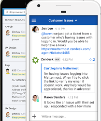
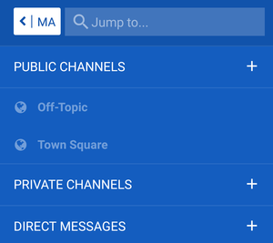
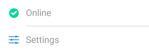

# HEADER_LINE

# Mattermost User Guide

Updated: @DATE

---

## Welcome to Mattermost!

[Mattermost](https://mattermost.com/) is a team chat tool that is being used at ORGANIZATION_NAME for facilitating communication and collaboration across units and groups. With Mattermost, your project or group can set up a private “team” hosted on our local Mattermost server to communicate and share resources.

## Table of Contents

* [Welcome to Mattermost!](#welcome-to-mattermost)
* [1. About this guide](#about-this-guide)
* [2. Getting started](#getting-started)
  * [2.1 Logging in](#logging-in)
  * [2.2 Username](#username)
* [4. Channels](#channels)
  * [4.1 List of channels](#list-of-channels)
* [5. Hashtags](#hashtags)
* [6. Activities](#activities)
* [7. Beginner checklist](#beginner-checklist)

## 1. About this guide

This guide is designed to get you up and running with the Mattermost app as quickly as possible and to give you an opportunity to become familiar with many of the features that are available.

During the first few days after you receive your invitation link to the platform, it might be a good idea to work through this guide with the assistance of a mentor who is familiar with the platform.

## 2. Getting started

Before you begin, make sure that you have installed the Mattermost app (not “Mattermost Classic”). If you are running into issues where the app is not working as expected (e.g., slow, not receiving messages or notifications etc), there is a good chance that you may have installed Mattermost Classic. Many display and responsiveness problems can be resolved by installing the correct app.

* [Get the Mattermost app on the **Android Play Store**](https://play.google.com/store/apps/details?id=com.mattermost.rn)
* [Get the Mattermost app on the **iPhone App Store**](https://itunes.apple.com/us/app/mattermost/id1257222717?mt=8)

### 2.1 Logging in

When you open the app for the first time it will ask you to enter a **Server URL**. Use the following URL to log in (make sure to include the **https://** at the beginning):

#### SERVER_ADDRESS

### 2.2 Username

The local Mattermost server is not connected to your institutional ID, so you will need to create a new username and password to use the platform.

The username itself must be in Latin characters only (a-z and 0-9), which means accents and other diacritics can't be used. Once you log in you will be able to set your Display Name or (Nickname), which will be visible to others and can include any characters you like, including accents, diacritics, or other character sets (see the Beginner checklist below for more details on how to change your Display Name).

## 3. Channels

Once you log in to the app using the Mattermost server invitation link provided to you, you should see an interface similar to the one in the screenshot below. You will find that the app is organized as a “team”, which is further divided into several “channels” with different topics:

* 

The default “Town Square” and “Off-Topic” channels are public, and depending on the team may be the only channels you are able to see after you first log in.

If your team is using private channels, you will not be able to see them when you first log in. After you have logged in your team administrator can invite you to view any private channels your team is using.

To activate the sidebar channel list, press the menu button (the three horizontal white lines on the far left in the screenshot below):

* 

The channel title is at the top of the screen (in the centre of the above screenshot).

To switch to a different channel, just press the channel name in the sidebar.

## 6. Beginner checklist

If there is not already a sandbox channel in your team, you can create one to provide a space where you can go through each of the items in the following step-by-step guide, which will help you get familiar with using the site.

Once you’re finished going through the checklist, head over to the **Town Square** or **Off-Topic** channel and say hi to the others in your team!

Below is the checklist -- to get the most out of it, try to follow these in order!

- [ ] Post a message!
  * Instructions: In a sanbox area (either create a private test channel or use a designated sandbox for your team), click on the textbox at the bottom of the screen (it should say “Write a message...”)
    * 
  * Type something! It could be anything at all (if you can’t think of anything, try “Testing” or “Hi!” )
  * A blue icon with a white arrow will appear on the right-hand side of the text box:
    * 
  * Click on the icon to post your message to the channel
  * You’re done!

- [ ] Reply to a message posted by someone else
  * Instructions: Tap once on an existing message in the sandbox channel, ideally posted by another user
  * The message should open in a separate screen as a conversation “thread”
  * Write and post your response in the message textbox as above
  * Your message will be counted as a reply to the original post, and responses in the conversation will be kept in chronological order
  * To go back to the main channel, just press the arrow button on the top left:
    * 
  * If you want to see all the responses to a particular post in order, just tap once on the original post or any of the replies to show the whole conversation
  * _Note: Replying to specific posts can help keep multiple conversations organized and can be particularly helpful if you have many members on your team_

- [ ] Edit a message
  * Did you make a mistake in your post or have something you want to change or correct? No problem! You can easily edit your posts by following the steps below:
  * Long press on the post you want to edit
  * A menu should pop up
  * Choose **Edit** from the menu
  * Your post will open up in a new textbox where you can change or correct it
  * When you’re done, make sure to press the **Save** button on the top right to save your changes
  * You should now see your edited post in the main channel window
  * _Note: You can only edit your own posts_

- [ ] Send a message to someone using the "@" feature
  * If you want to get someone’s attention you can make sure that they get a notification by including their username after the @ symbol (e.g., @example)
  * Try it out! Address a message to someone on your team by including their name in your post
  * _Note: To get the attention of **everyone** in a particular channel you can use @channel, but try to use this sparingly!_

- [ ] Upload a picture from your phone using the attach feature
  * Tap on the **plus (+) symbol** to the left of the message textbox:
    * 
  * Choose a source for the image (e.g. your phone camera or a picture from your photo gallery)
  * If you selected “Camera” then take a photo -- you should then be taken back to the app
  * (Optionally) write a message to accompany your picture
  * Press the send button to post your message as usual
  * You’re done!

- [ ] Post a message using emoji
  * There is support for a large selection of emoji/emoticons
  * There are 3 ways to add emoji to a message:
    - [ ] Using simple “smiley” style, for example **:)** or **:D**
    - [ ] Using the name of the emoji surrounded by colon characters (:), for example **:grin:** or **:joy:**
    - [ ] Using the pop-up emoji selector -- just type a colon character (:) and choose from the list that pops up (to narrow down the list, just start typing the name of the emoji you want)
  * Try it out! Use one of the methods above to post an emoji to the sandbox channel

- [ ] Post a reaction to a message using a reaction emoji
  * You can also use emoji to react to someone’s post without making a separate message yourself
  * Instructions: Just long-press on any message and tap on **Add Reaction**
  * Then select an emoji from the list that pops up
  * You should see your selected emoji show up underneath the post as a reaction:
    * 
  * _Note: The total number of people who have reacted will be shown beside each emoji; if you tap on a reaction that someone else has posted, your reaction will be added to the total number!_

- [ ] Use simple formatting like **bold** and _italic_
  * Instructions: Use two asterisks (\*\*) around a word or phrase to make it **bold**, for example \*\*bold\*\*
  * Use a single underscore on both sides of a word or phrase to make it _italic_, for example \_italic\_
  * Try it out! Post a message using bold or italic to the sandbox channel

- [ ] Learn about more basic formatting
  * The Mattermost app uses a text formatting syntax called _Markdown_ that you might be familiar with if you have posted on various popular websites
  * You can find a detailed guide to formatting in Mattermost [here](https://docs.mattermost.com/help/messaging/formatting-text.html)
  * Try it out! Follow the [formatting guide](https://docs.mattermost.com/help/messaging/formatting-text.html) to post a message to the sandbox channel with **strikethrough** text, a clickable **link**, or a **table**

- [ ] Use a hashtag "#" to categorize your message
  * Hashtags make it easier to organize and find posts
  * Hashtags are clickable like links, and begin with a # character
  * You can create hashtags using any word or phrase (without spaces) preceded with a **# character**, for example #agenda or #followup
  * Try it! Post a message using the hashtag #test or #testing
  * Then tap on the hashtag link to see other posts with the same tag
  * _Note: To click on hashtag links, you will need to log in to [the web interface](SERVER_ADDRESS) using the username and password you created earlier_

- [ ] Log into the web interface
  * Some advanced features require you to use the [Mattermost web interface](SERVER_ADDRESS), for example:
    * Changing your Display name or Nickname
    * Previewing links
    * Embedding images
    * Viewing embedded YouTube videos
    * Changing the app theme
    * Changing the interface language
  * The optional steps below show you how to access these features
  * In most other ways, the web interface is essentially the same as the mobile app -- you can post, use emoji, and catch up on new messages
  * Try it out! Go to the [Mattermost web interface](SERVER_ADDRESS) and try posting something in the sandbox channel using the hashtag #web

- [ ] **(OPTIONAL)** Embed an existing online image in a message
  * Using the online [web interface](SERVER_ADDRESS), you can embed images with the following simple code:
    * `)`
  * _Note: make sure to post this exact code (with a different link, of course) or the image won’t show up_

- [ ] **(OPTIONAL)** Set up your notification preferences
  * Instructions: Activate the sidebar by pressing the menu button (the three horizontal white lines on the far left in the screenshot below):
  * _If using the mobile app:_ Press the three-dot icon at the top right hand corner of the sidebar and select **Settings** from the options that appear (see screenshot below)
    * 
  * _If using the web interface:_ Select “Account Settings” (the first option in the Settings menu)
  * Select “Notifications”
  * You may want to disable email notifications
  * You can choose to be notified only on being mentioned by name, or for all new activity on the site (this could result in quite a lot of notifications, depending on the size of your team!)

- [ ] **(OPTIONAL)** Set your preferred display name
  * Instructions: To change your display name, you will need to log in to [the web interface](SERVER_ADDRESS) using the username and password you created earlier
  * Click on the menu icon in the sidebar and then select **Account Settings**
  * Under the **General** tab, change the name beside **“Nickname”** to your preferred name as you would like it to be visible to others on your team

---

**We hope you have found this guide helpful. See you online!**

Guide prepared by [@dohliam](https://github.com/dohliam). For source details and instructions on how to build this guide for your own organization, see the [repository on GitHub](https://github.com/dohliam/mattermost-user-guide).

 This work is licensed under a <a rel="license" href="http://creativecommons.org/licenses/by/4.0/">Creative Commons Attribution 4.0 International License</a>.
